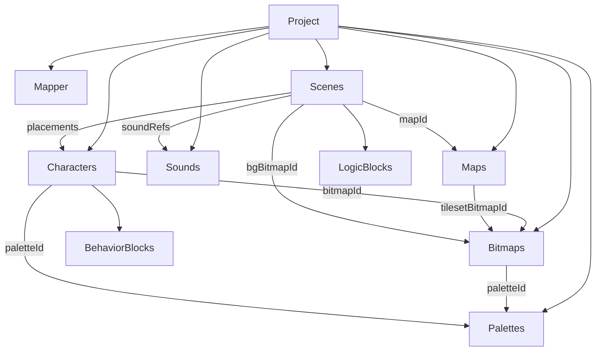

# 09. Create プロジェクトモデル（v3）

> **位置づけ**: Create（作る側）の正本データモデルと編集 UX の仕様。
> M11 の「パーツ／シーン並列タブ」は途中経過であり、**公開前に本モデルへ置き換える**（[02_ROADMAP.md](02_ROADMAP.md) M12）。
>
> **実装状況**: 型・JSON 往復・v2→v3 移行・エクスプローラ殻・**パレット編集 / ビットマップ手描き / 画像アップロード減色**まで。キャラ・シーンのブロック本接続とビルドは後続。

## なぜ作り直すか

現状（v2）の不満:

- 8×8 タイル手描き中心で、画像アップロード→ビットマップ化が無い
- 紐づけが手書き DSL 依存（ノンプログラマ向けなのにコードが主）
- ブロックが従、JS 風コードが主になっている
- タブを探し回って個別編集。ツリーで辿れない
- マッパーがプロジェクトに無く、「何が作れるか」の制約が見えない

## 設計原則

1. **プロジェクトの根は `mapperId`**（対応済み 0 / 1 / 2 / 3 / 4 / 7）。最初に選ぶ。
2. **ソース・オブ・トゥルースは構造化データ＋ Blockly**。コードはビルド中間／読み取り専用プレビュー。
3. **資産は別枠で作り、親は参照だけ持つ**（ダイナミックリンク型）。
   - パレット／ビットマップ／キャラ／音／マップ等はプロジェクト直下のカタログで独立に作成・編集する
   - シーンやキャラなどの「親」は ID 参照を置くだけ。実体のコピーは持たない
   - **参照を切っても資産は残る**（流用・再リンク可能）。削除はカタログ側の明示操作のみ
   - **ビルドは参照グラフでツリーシェイク**: エントリシーン等から辿れない資産はバイナリに入れない（`collectUsedAssets`）
4. **参照は ID**。表示名は別フィールド。ピッカー／ツリーから選ぶ。手書きで紐づけない。
5. **ビットマップはタイルの塊**（幅・高さはタイル単位）。単体 8×8 前提を捨てる。
6. **パレットは名前付き資産**。bitmap が `paletteId` を持つ。
7. **衝突は標準ランタイム機能**。手書き座標比較に頼らず、データ＋イベントブロックで組み込む（詳細は下記「衝突」）。

## ツリー構造

```
Project（mapperId, title, author）
├── palettes/          名前付き 4色（NES index）※カタログ
├── bitmaps/           画像または手描き → タイル格子 + paletteId ※カタログ
├── characters/        bitmapId + behavior（Blockly）※カタログ
├── sounds/            SE/BGM 資産 ※カタログ
├── maps/              （後続）タイルセット参照 + マス配列 ※カタログ
└── scenes/            ※カタログ。中身は参照とロジックのみ
    ├── placements[]   characterId + x,y（参照）
    ├── background?    bitmapId（参照）
    ├── mapId?         （後続）Map への参照
    ├── soundRefs[]    soundId（参照）
    └── logic          Blockly（init/update 相当）
```

親子はすべて **ID リンク**。シーンからキャラを外してもキャラ資産は残る。同じビットマップを複数キャラ／複数マップが参照してよい。



## エンティティ

型の正本は `apps/web/src/projectV3.ts`。

| 型 | 要点 |
|---|---|
| `ProjectV3` | `version: 3`, `mapperId`, メタ情報, 資産辞書（Record&lt;id, …&gt;）, `sceneOrder` |
| `PaletteAsset` | `id`, `name`, `colors: [c0,c1,c2,c3]`（各 0–63） |
| `BitmapAsset` | タイル格子 + pixels(0–3)。`paletteId` は編集・取り込み時の作業パレット |
| `CharacterAsset` | `bitmapId` + **`paletteId`（デフォルト／プレビュー）**。色違いはパレット差し替え。behavior blocks。**当たり判定・衝突応答**（後続フィールド） |
| `SoundAsset` | v2 相当 + `id` |
| `MapAsset` | （後続）tileset 参照 + マス配列 + **歩行可／不可（solid）** |
| `SceneAsset` | `id`, `name`, `placements`, `backgroundBitmapId?`, `mapId?`（後続）, `soundIds`, `logicBlocks?`, `legacyCode?` |
| `ScenePlacement` | `id`, `characterId`, `x`, `y`（後続: `role: prop \| actor`） |

ID はプロジェクト内で一意な短い文字列（例: `pal_1`, `bmp_player`）。表示名変更で参照は壊れない。

## 衝突

ゲームの標準機能として組み込む。ユーザーが毎フレーム「重なったか」を手書きしない。

### 何と何が当たるか

| 種類 | データ | ランタイム | 作者が書くこと |
|---|---|---|---|
| **マップ ↔ アクター** | マップの `solid`（タイル属性） | 移動前／移動後に壁判定。押し戻しはエンジン側 | 基本は不要。必要なら「壁に当たったとき」イベント |
| **アクター ↔ アクター** | 各キャラのヒットボックス | 重なり検出 → 応答＋イベント | 「◯◯と当たったとき」ブロック |
| **アクター ↔ 置き物（prop）** | 同上（prop もヒットボックス） | 同上 | 宝箱・弾・アイテム等はここで |

ヒットボックスはキャラ資産の属性（既定はビットマップの外接矩形。後からオフセット／縮小可）。参照リンクなので、同じキャラ定義を置いたインスタンスは同じ当たりを共有する。

### 衝突した「あと」の標準応答

キャラ（または配置）に **物理応答** を持たせる（ブロックの前にエンジンが処理）:

- `none` … すり抜け（トリガーのみ。アイテム・チェックポイント向け）
- `block` … 侵入しない／押し戻す（壁・NPC）
- `bounce` … 簡易跳ね返り（ボール等。パラメータは後続）

「当たったらスコア＋1」「シーン切替」など **ゲーム意味** は物理応答ではなく **イベントブロック** に書く。

### ブロック上の置きどころ

| 対象 | ブロック例 |
|---|---|
| キャラ behavior | 「（自分／この種類が）◯◯に当たったとき」「壁に当たったとき」 |
| シーン logic | 「配置 A と B が当たったとき」（シーン固有の演出向け。常用はキャラ側） |

相手の指定は **キャラ資産への参照（ID）** またはタグ（後続）。名前の手打ちやインスタンス番号依存にしない。

### ビルド／ツリーシェイクとの関係

衝突イベントブロックが参照するキャラ ID・マップ ID も参照グラフに含める。イベントだけ書いてシーンに配置が無い相手は警告対象（未使用資産と同様、バイナリには載せない／またはビルドエラーは実装時に決定）。

## 編集 UX

| 領域 | 内容 |
|---|---|
| 左 | エクスプローラ（上記ツリー）。ノード選択で右が切り替わる |
| 右 | 選択中アセットの専用エディタ。キャラ／シーンのロジックは **ブロックが主**。コードタブは生成プレビュー（編集不可または上級者向け） |
| 新規プロジェクト | タイトル入力 → **マッパー選択** → 空のパレット1・シーン1 をシード |

紐づけ操作の例:

- ビットマップ作成時にパレットをドロップダウンで選択
- **画像からビットマップ作成**: 4色を推定 → 同一パレットがあれば再利用、なければ新規 → ビットマップに紐づけ
- キャラクターはビットマップ＋**デフォルトパレット**（プレビューはこのパレット）。同じ絵でパレット違いの 1P/2P が可能
- シーンの「配置を追加」でキャラクターを選択し座標を入れる

## 画像アップロード

1. ユーザーが PNG/JPEG 等を投入（「画像から自動」）
2. 不透明画素を NES 64色に落とし、頻度から4色パレットを推定
3. `findOrCreatePalette` で同一色パレットを再利用、または新規作成
既定は人型 16×16（2×2 タイル）。弾は 8×8、ロゴ等は大きめプリセットを選び、表示を「フィット」にすると全体を見ながら編集できる。最大 32×32 タイル（画面幅相当）まで。

## 提供アセット（ビルトイン）

カタログ: `apps/web/src/providedAssets.ts`。

| パック | 内容 |
|---|---|
| `font-jp-basic` | 半角英数記号・ひらがな・カタカナを 8×8 グリフとしてプロジェクトへ取り込み可能 |

- 取り込み後は通常のビットマップ（`providedSource` 付き）としてツリーに並ぶ
- **ビルド時はシーン等から参照されたビットマップだけ CHR に載せる**（`collectUsedAssets.ts`）。フォントを全部入れても未使用字はバイナリに入らない
- 現状の参照経路: シーン配置→キャラ→bitmap、シーン背景。テキストランからの参照は後続

プロジェクト画面の「基本フォントを取り込む」から追加する。

## マッパー選択（Create で選べるもの）

エミュ対応済みのみ（[04_EMULATOR_SPEC.md](04_EMULATOR_SPEC.md)）:

| ID | 名称 | Create での目安 |
|---|---|---|
| 0 | NROM | 小規模。PRG 32KB / CHR 8KB 級 |
| 1 | MMC1 | 中規模バンク |
| 2 | UxROM | PRG バンク中心 |
| 3 | CNROM | CHR バンク中心 |
| 4 | MMC3 | 本格。IRQ 前提の表現も視野 |
| 7 | AxROM | 32KB PRG 切替 |

未対応マッパーは選択不可。容量超過はビルド時にエラー。

## ビルド（後続）

1. **使用資産の収集**: エントリシーン（および明示参照）から ID 参照を辿り、到達可能なものだけを対象にする。カタログにあっても未参照ならバイナリに入れない
2. bitmaps → CHR タイル列へパッキング（参照順・重複排除は実装時に決定）
3. characters / scenes の Blockly → DSL 断片生成
4. placements / palette から `instance` / `setPalette` 等を **生成**（手書きしない）
5. 既存 `dsl-compiler` + `rom-builder` に渡し、`mapperId` を iNES ヘッダへ反映

## v2 → v3 移行

- `parts[]` → 各 part の tiles を 1×N タイルの bitmap + character（`legacyCode` / blocks 引き継ぎ）
- `scenes[]` → SceneAsset（placements 空、`legacyCode` に旧 code）
- `sounds[]` → SoundAsset（id 付与）
- `mapperId` 既定 `0`
- 既定パレットを1つ自動生成し、移行 bitmap が参照

## 公開判定チェックリスト

Create を公開してよいと言える条件:

- [ ] ツリーからシーン／画像／キャラ／音に辿って編集できる
- [ ] 紐づけがピッカー／ID 参照で、手書き JS が必須でない
- [ ] ブロックが主編集面（コードは見るだけ）
- [ ] 8×8 以外のビットマップ（アップロード含む）を扱える
- [ ] 新規プロジェクトでマッパーを選ぶ
- [ ] v3 から `.nes` がビルドできる

## 関連

- 旧アセット構想: [05_ASSET_EDITOR_SPEC.md](05_ASSET_EDITOR_SPEC.md)（本モデルへ段階的に寄せる）
- アーキテクチャ: [01_ARCHITECTURE.md](01_ARCHITECTURE.md)
- DSL（ビルド中間）: [03_DSL_SPEC.md](03_DSL_SPEC.md)
